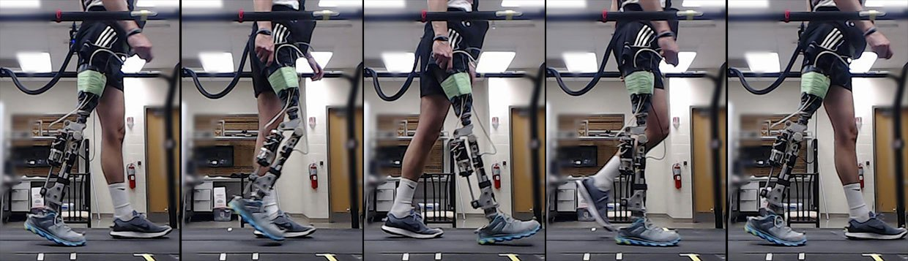

# Data visualisation

By which researchers are able to document, share, collaborate, communicate, teach and allow for reproducible research. A workflow could include 3D scanning, photogrammetry and 3D rendering.

