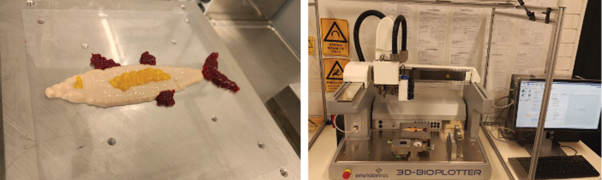

# Prototyping

By which researchers are able to use experimental methods and iteration to fail fast and succeed faster. A workflow could include 3d printing and 3d design to produce physical objects.

In a recent example the design team at NExTLAB with the Engineering workshop were able to quickly prototype and produce protective equipment for frontline medical staff during the Covid-19 pandemic. You can read more about that project in Persuit:



