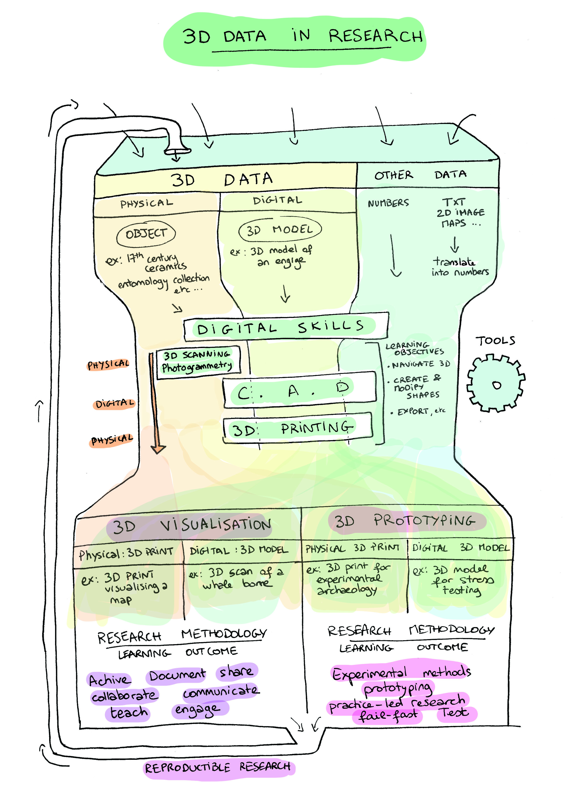
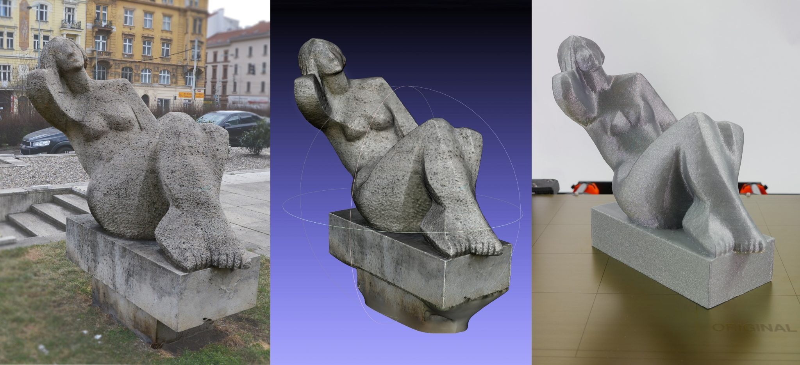

# What is 3d Data?

### Put simply **3d Data** is o**bject based data, it** is a mathematical representation of something three dimensional. 

For the purposes of establishing a broad ecology of tools with which to handle your research data, we are going to be working with 3d Data under this very broad definition. It could take the form of 3d Scans, a 3d design created with Computer Aided Design, a 3d print or even raw number sets.

What we are going to be talking about to is not so much how you can record your data, but more about how you can handle your data and what benefits that can bring to your research.

\_\_

