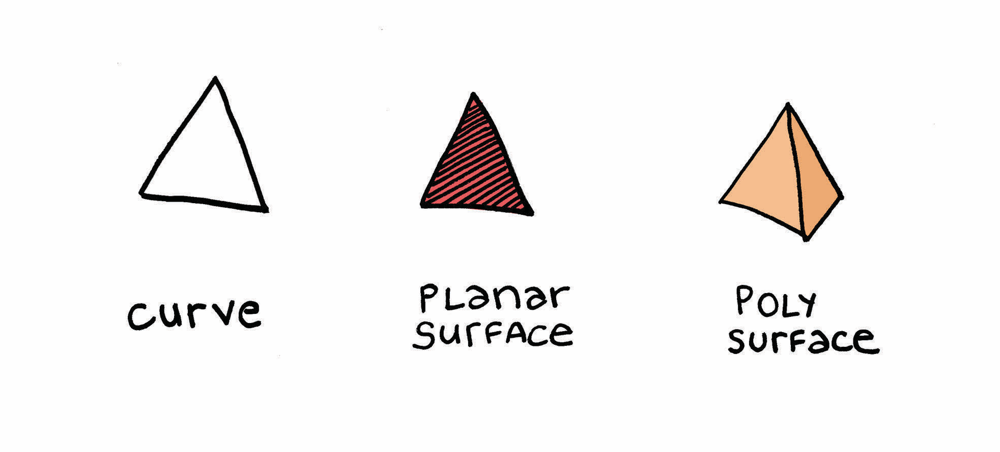
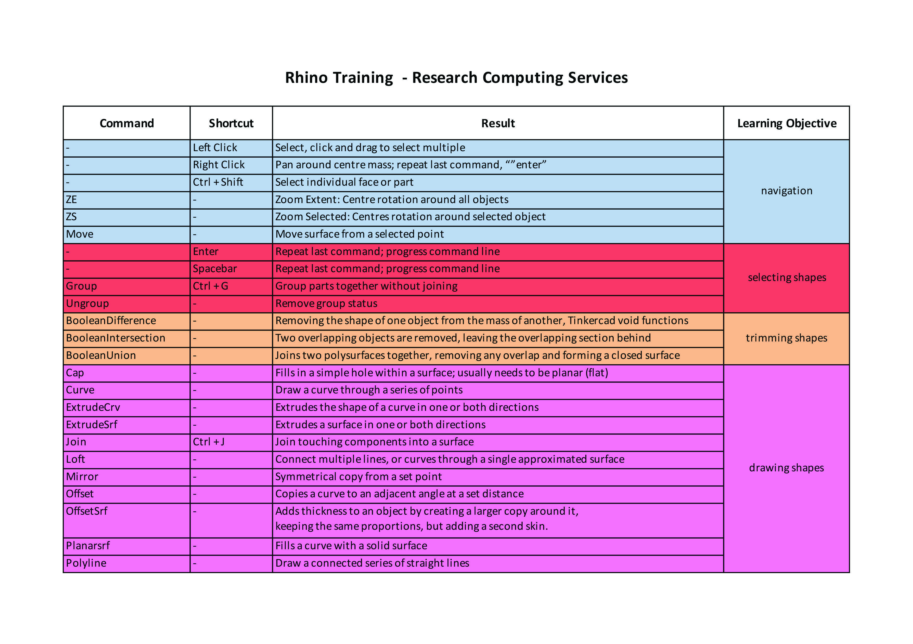

# Cheatsheets and other resources

### Definitions:

**Curve:** Refers to lines. Any drawn lines, any drawn shapes closed or open.

**Planar Surface:** A single face that is solid or filled.

**Poly Surface:** A collection of planar surfaces.

**Boolean:** The term for intersecting shapes and how the intersection is handled.

### Shortcuts Cheatsheet:

### 

