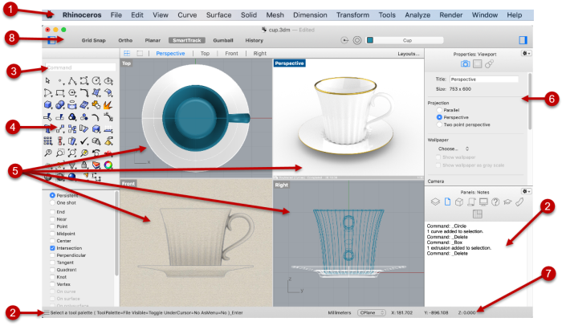

# The Interface

| \*\*\*\* | \*\*\*\* |
| :--- | :--- |
| **Menu \(1\)** The menus group Rhino commands by function. | **History window \(2\)** The command history window displays the previous commands and prompts. |
| **Command box \(3\)**The command box displays a typed command. Once the command is accepted, the prompts, options and a Value box appear in this space. | **Toolbars \(4\)** Toolbars contain graphical icons for initiating commands. Many toolbar icons have a second command that you can access by right-clicking the icon. The tooltip that appears when you hover over the icon tells you what the left and right mouse button do. |
| **Viewports \(5\)** Viewports display the Rhino working environment. | **Sidebar \(6\)** The right sidebar contains layers, properties, and other settings.The left sidebar contains the toolbar and the object snap list. |
| **Status bar \(7\)** The status bar is located at the bottom of the Rhino window. It displays the current coordinate system, the cursor location and system unit. | **Top panel \(8\)** The top panel has quick access to layers, object properties and toggles of modeling aids. |
|  |  |

