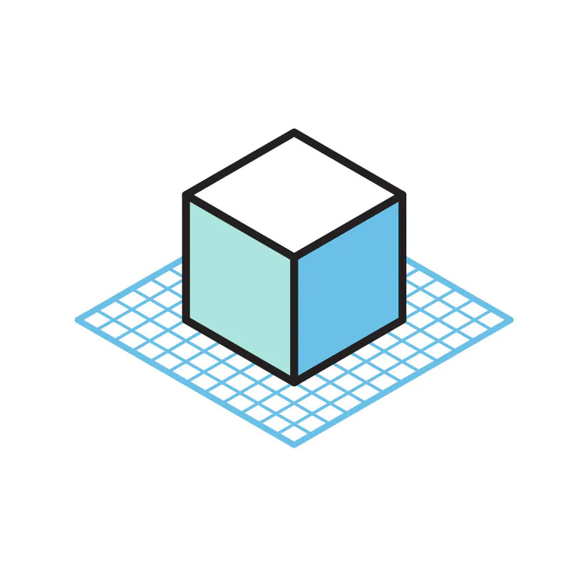
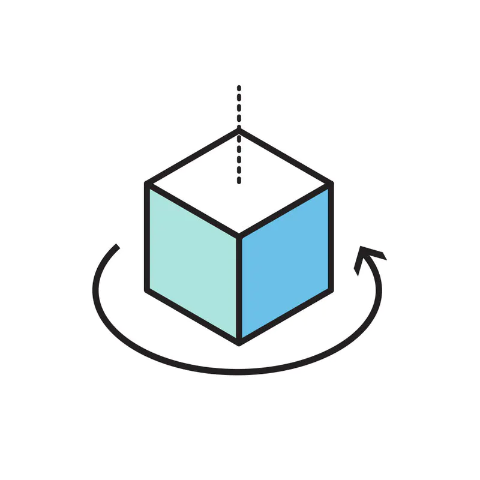

# How it works

The best way to learn TinkerCAD is to play around with it! To get you started, using TinkerCAD can be broken down to 3 easy steps:

#### 1. Place

Shapes are basic building blocks of Tinkercad. A shape can add or remove material. Import your own, or work with existing shapes.

#### 2. Adjust

Move, rotate and adjust shapes freely in space. Use tools like the ruler to input exact dimensions.

#### 3. Combine

Group together a set of shapes to create models as detailed as you want.

