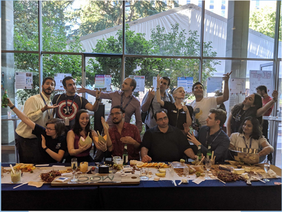

# Our Philosophy

We believe in community and empowering researchers. We believe in researchers helping researchers, and working smarter not harder. We avoid teaching as a death by PowerPoint, and we don't want you to learn new digital tools by watching a screen. Instead, we have faith in our students and focus on a problem-based pedagogical approach.

Learning new digital tools can be hard, especially when your research interests and methodologies are diverse and complex. As such, we firmly believe in supporting and empowering communities of researchers to help each other. Our trainers cannot answer all the questions that you might have about the applicability of digital tools to your research, but we hope that by creating a community of researchers that someone might be able to help you out.

