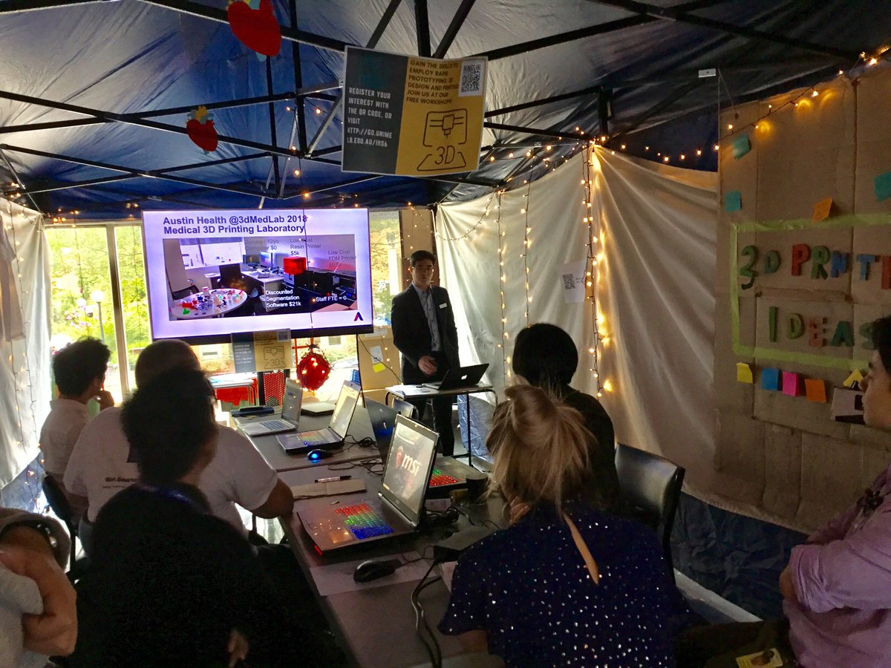

# The Power of Community

Our goal at Research Computing Services is to build communities of digitally empowered researchers at the University of Melbourne. Traditionally, we have created communities by running social events, and offering pathways for researchers to involve themselves in our communities. These community leaders we refer to as ResLeads, and over the years they've been involved in taking the lead on running meetups where we teach advanced digital skills, and in connecting with specific faculties at the University to tailor the tools to their needs. Online, things are a little different and this is certainly new territory for us.

Do you have a question about a specific project that you are working on? Join us at our fornitly meet up on zoom, you can sign up for the next upcoming meetup [_here_](learning-material/tinkercad/). ~~&lt;-- add link~~  
  
We also have a Facebook group where you can ask questions and receive help with the modules and other questions that you might have as a researcher, you can join that community [here](https://www.facebook.com/groups/unimelbnvivo).

There is also a monthly 3d Data newsletter to keep you up to date with what is happening in the community, and if there are any upcoming social events and opportunities. You can sign up for the newsletter [here](https://resbaz.us20.list-manage.com/subscribe?u=327379730541e10b4f7d8e236&id=f45691e329). ~~&lt;-- add link~~

