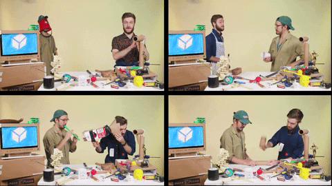

# Course Overview

For the purposes of establishing a broad ecology of tools with which to handle your research data, we are going to be working with 3d Data under a very broad definition. Here 3d Data could take the form of 3d Scans, a 3d design created with Computer Aided Design, a 3d print or even raw number sets.  

Click bellow to learn more about what 3d data is and what tools might be right for you, or to go straight to a tool! You can participate in these courses as often as you like until you have assessed your own learning as successful.  







