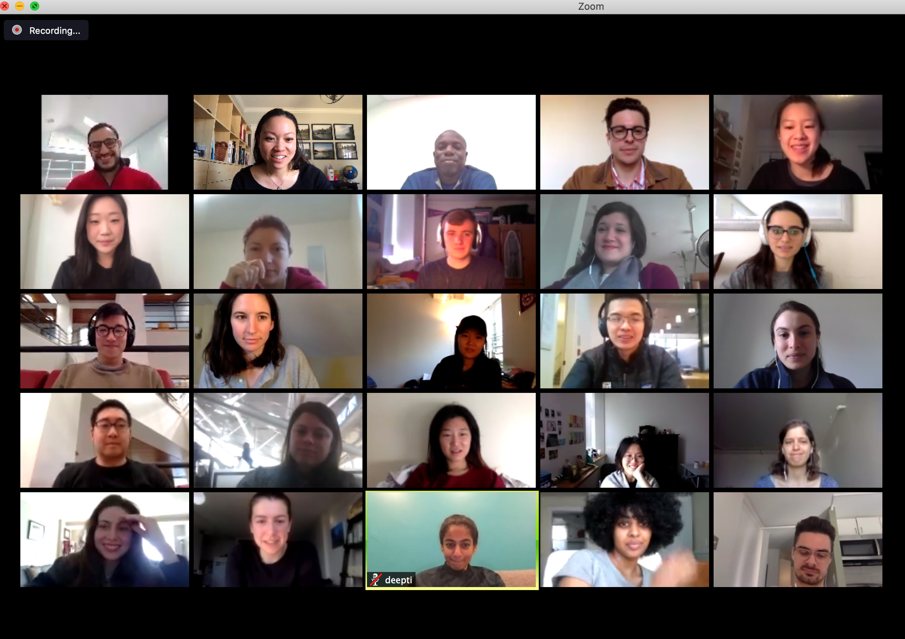

# Training Format

This course is separated into individual modules. Whilst the modules are designed to be accessed during an online learning workshop \(via Zoom\), they are also accessible for those who cannot attend.

Each module consists of four sections with an associated challenge and learning objective attached. Whilst the online training sessions will run for around 40 minutes with 20 minutes for unstructured questions, students are encouraged to work through the sections at their own pace.

