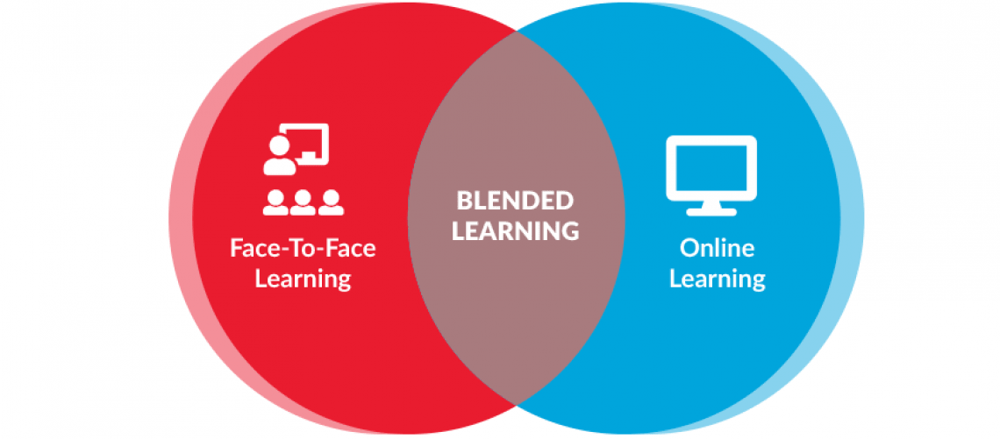

# What is Blended Learning?

Blended learning is the combination of traditional student-centred in-class learning with other complementary learning methodologies. This resource is currently intended as an accessible alternative to in-class learning which has been made unavailable due to COVID-19. The modules blend written guides, engaging videos, and hands-on challenges. Online webinars aim to provide hands-on support and to reinforce the content of the modules. The in-class workshops focus on problem-based group challenges - which we hope to have maintained on this online resource.

